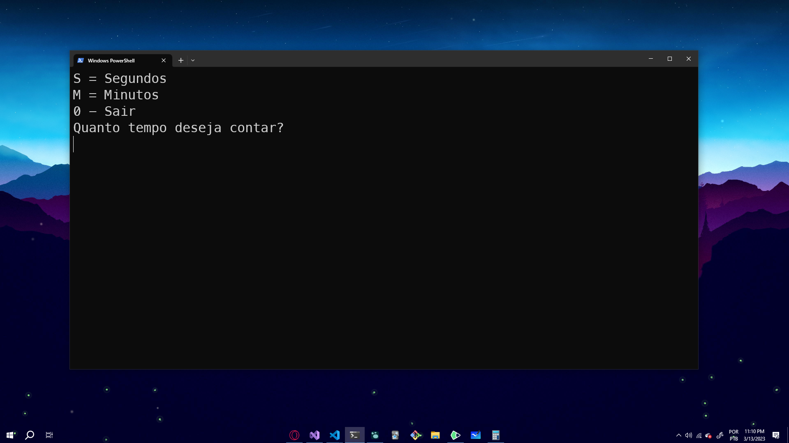
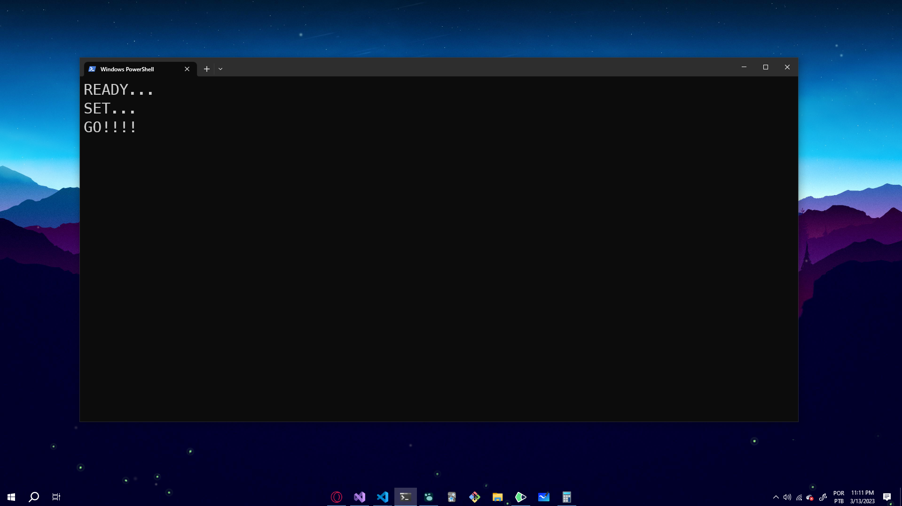

# Stopwatch

Projeto feito pelo curso de [Fundamentos do C#](https://balta.io/cursos/fundamentos-csharp) do Balta. Bastante introdutório mas que aplica conhecimentos adquiridos durante o curso e que são de extrema importância.

## Instalação

1. Clone o repositório para sua máquina

```
git clone https://github.com/thomazllr/Stopwatch.git
```
2. Entre na pasta
```
cd Stopwatch
```
3. Rode o programa

```
dotnet run
```

### Segue imagens do projeto:



